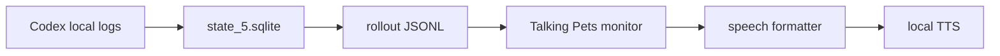

# Talking Pets

Talking Pets is a small add-on that reads Codex Pet bubbles or the latest Codex assistant reply aloud with local TTS.

It reads local conversation logs and sends short spoken lines to VOICEVOX, Kokoro, or OS speech without patching Codex or modifying a signed app bundle.
It does not replace your existing Codex Pet. It adds a local voice layer to the pet experience you already use.

First time here: [Demo recording](https://github.com/arata-ai-daisuki/talking-pets/blob/main/docs/demo/talking-pets-overlay-2026-05-28.mov) -> [First five minutes](#first-five-minutes) -> [Quick Start](#quick-start) -> [Open an issue](https://github.com/arata-ai-daisuki/talking-pets/issues)

If this looks useful, a GitHub Star helps guide the next TTS, multilingual, and latency improvements.

If you can help with Windows / Linux real-device checks, VOICEVOX latency on another machine, or Irodori on another GPU, see [ways to help](docs/contributor-entrypoints.md).
Quick verification issues: [Linux #23](https://github.com/arata-ai-daisuki/talking-pets/issues/23) / [Windows #24](https://github.com/arata-ai-daisuki/talking-pets/issues/24) / [Irodori #25](https://github.com/arata-ai-daisuki/talking-pets/issues/25) / [VOICEVOX #26](https://github.com/arata-ai-daisuki/talking-pets/issues/26)
If you can share Korean, Chinese, or other dedicated-provider evidence, use the [Minimal Multilingual Report Form](docs/real-device-verification.md#minimal-multilingual-report-form) and mark whether the result is fallback-only or provider-specific.

To check what is verified, what is waiting, and how to share useful evidence, start from the [Public proof hub](docs/contributor-entrypoints.md#public-proof-hub).

Latest feature update summary: [Voice Personalization Feature Update](docs/feature-update-voice-personalization.md)


## First Five Minutes

Start with the demo recording to see the "voice layer for Codex Pet" experience, then try the no-extra-install macOS path if it looks useful.

1. Watch it: [Demo recording](https://github.com/arata-ai-daisuki/talking-pets/blob/main/docs/demo/talking-pets-overlay-2026-05-28.mov)
2. Try the fastest path: on macOS, choose `macOS say` to test without VOICEVOX or model downloads.
3. Check your setup: `./check.command` verifies the local environment and prints public-friendlier dry-run output.
4. If you get stuck: open an [Install trouble issue](https://github.com/arata-ai-daisuki/talking-pets/issues/new?template=install_trouble.yml) or start from [ways to help](docs/contributor-entrypoints.md).

Windows and Linux are still experimental. Treat those paths as real-device verification entrypoints rather than the most reliable first-run path.

## Demo Recording

<video controls width="100%" src="https://github.com/arata-ai-daisuki/talking-pets/raw/main/docs/demo/talking-pets-overlay-2026-05-28.mov">
  <a href="https://github.com/arata-ai-daisuki/talking-pets/blob/main/docs/demo/talking-pets-overlay-2026-05-28.mov">Watch the demo recording</a>
</video>

[](https://github.com/arata-ai-daisuki/talking-pets/blob/main/docs/demo/talking-pets-overlay-2026-05-28.mov)

If GitHub does not render the video player in your environment, click the still frame above or open the [demo recording](https://github.com/arata-ai-daisuki/talking-pets/blob/main/docs/demo/talking-pets-overlay-2026-05-28.mov) directly.

Japanese: [README.md](README.md)

## Status

This repository is a public-review-ready MVP. The macOS Swift monitor is the stable path. Windows and Linux are experimental paths through the Node monitor.

| Environment / Feature | Status | Notes |
| --- | --- | --- |
| macOS Swift monitor | Stable | Recommended path. Uses `afplay` and `say`. |
| macOS Node monitor | Experimental | Portability path for Windows / Linux validation. |
| Windows Node monitor | Experimental | PowerShell scripts are included. Real-device validation is ongoing. |
| Linux Node monitor | Experimental | Audio playback depends on `aplay`, `paplay`, `ffplay`, or `espeak`. |
| VOICEVOX | Optional | Recommended for Japanese. Start VOICEVOX Engine separately. |
| Kokoro.js | Optional | Mostly English voices. Downloads model files on first use. |
| Irodori-TTS Server | Experimental optional | Japanese-oriented. Start Irodori-TTS-Server separately. |
| OS speech | Fallback | Uses macOS `say`, Windows `System.Speech`, or Linux `espeak`. |

## Important Notes

- The Pet character shown in the demo recording is from the author's local environment. This repository does not include Pet images, Live2D assets, avatar assets, or character artwork.
- Talking Pets is an MVP that reads local `state_5.sqlite` and rollout JSONL files. It does not use a public Codex API. Future Codex updates may change storage paths, database schema, JSONL shape, or Pet overlay behavior, which can break this add-on.
- If you suspect a Codex compatibility change, first run `npm run check:compat` to verify the local Codex storage shape, then use `./scripts/pet-rollout-monitor.command --once --dry-run` only when you need to debug latest-assistant extraction. Remove private paths, conversation text, and credentials before sharing output publicly.

## Safety Model

| Target | Behavior |
| --- | --- |
| Codex Desktop app | Does not patch Codex or modify signed app bundles. |
| Codex local metadata | Reads thread and rollout paths from `state_5.sqlite`. |
| Codex rollout JSONL | Reads local files to find the latest assistant reply. |
| OpenAI API / external LLMs | Not called by default. No extra API billing is needed for the MVP formatter. |
| VOICEVOX | Sends spoken text only to your locally running VOICEVOX Engine when selected. |
| Kokoro.js | Downloads model files on first use and generates speech locally. |
| Custom TTS endpoint | May receive conversation text if you configure one. |

## Requirements

Required:

- Codex Desktop or Codex CLI saving local conversation logs
- Node.js 22 or later
- npm

Stable macOS path:

- macOS
- Swift runtime
- `afplay` for audio playback
- macOS `say` as a fallback

For Japanese voices:

- VOICEVOX Engine
- VOICEVOX Engine running at `http://127.0.0.1:50021`
- Default voice: Zundamon Normal, `speaker=3`

For English voices:

- `kokoro-js`
- Network access for the first Kokoro model download

For Irodori-TTS:

- Irodori-TTS-Server
- Irodori-TTS-Server running at `http://127.0.0.1:8088`
- This is an experimental manually selected provider for Japanese input. It is not part of the default auto route.

Windows experimental:

- Node.js 22 or later
- PowerShell
- VOICEVOX Engine or Kokoro
- Codex `state_5.sqlite` available under the user home directory

Linux experimental:

- Node.js 22 or later
- bash
- `aplay`, `paplay`, or `ffplay` for audio playback, or `espeak` for OS speech
- Matching local TTS setup when using VOICEVOX Engine or Kokoro

## Quick Start

For the fastest macOS check, start with these three commands:

```bash
cd /path/to/talking-pets
./install.command
./check.command
./start-selected-tts.command
```

If you want the shortest no-extra-install speech check, pin the installer to macOS say. This is a first-run isolation path, so it does not require VOICEVOX Engine or a Kokoro model download.

```bash
printf 'en\n4\nKyoko\n' | ./install.command
```

`./check.command` uses fixture-based checks, while real local Codex state verification stays in `npm run check:compat`. Before pasting output into a public issue, run it through `npm run sanitize:public-output` and manually check that private paths or conversation text are not present.

The macOS installer first asks for a display language (`en` / `ja`), then lets you choose a local TTS provider. If unsure, choose `1` for automatic routing.

| Choice | Best for | Extra setup |
| --- | --- | --- |
| Auto routing | Mixed Japanese and English | VOICEVOX Engine and npm ci |
| VOICEVOX | Natural Japanese voices | VOICEVOX Engine |
| Kokoro.js | Local English-oriented voices | npm ci and first model download |
| macOS say | Fastest no-extra-install check | None |
| Voicebox-compatible endpoint | Custom or generic local voice endpoints | endpoint URL and any required profile/language |
| Irodori-TTS Server | Try Irodori after starting it yourself | Irodori-TTS-Server |

If you choose VOICEVOX, start VOICEVOX Engine first and make sure it is listening at `http://127.0.0.1:50021`.
If you choose a Voicebox-compatible endpoint, the installer can save the endpoint URL, mode, profile, and language.
Kokoro.js downloads model files on first use. The default cache path is `~/.cache/talking-pets/transformers`. The default q8 model is about 92 MB, so the first run can take a little while.
Irodori-TTS Server is not bundled in this repository. Start it in a separate terminal first and confirm that its `/health` endpoint responds.
`/health` may respond before the model is loaded. The first real synthesis can take several minutes because Irodori may download the model and load the runtime. Even after the model is loaded, short warm synthesis can still take tens of seconds depending on CPU/GPU and device state.
If the first request times out, start Irodori-TTS-Server with `IRODORI_PRELOAD=true` so the model loads during server startup, or increase `IRODORI_MODEL_LOAD_TIMEOUT` / `IRODORI_SYNTHESIS_WAIT_TIMEOUT` on the Irodori server side when needed. From Talking Pets, run `npm run tts:irodori -- --health --url http://127.0.0.1:8088 --profile-latency` and check `/health` fields such as `runtime.loaded` and `runtime.loading` before trying a short synthesis.
Perceived Irodori speed depends heavily on device performance, CPU/GPU/MPS/CUDA/ROCm, Irodori settings, text length, and cold/warm state. If you can test another machine, please share results with the [Irodori latency contribution](docs/real-device-verification.md#irodori-latency-contribution) format.

### Latency snapshot

These are short-text measurements from the maintainer environment. They are not performance guarantees; use them as rough guidance for provider choice and further testing. See [docs/verification-status.md](docs/verification-status.md) for the current verification status.

| TTS path | State | Example measurement |
| --- | --- | --- |
| macOS `say` | no-extra-install control | `total=440.1ms`, `speak=434.9ms` |
| VOICEVOX speaker 3 | Engine already running, no playback | warm synthesis total `1334.3ms` / `1388.6ms` / `2206.6ms` |
| VOICEVOX speaker 3 | Engine already running, playback included | `total=5693.8ms`, `synthesis=1127.8ms`, `play=4398.6ms` |
| Irodori-TTS Server | runtime already loaded, no playback | warm synthesis total `9565.2ms` / `10096.2ms` / `16708.0ms` |

VOICEVOX playback-included `total` includes waiting for playback to finish; it is not the same as time to first audible speech. For generation speed, also keep RTF separate: synthesis time divided by generated audio duration. See [TTS Provider Comparison](https://github.com/arata-ai-daisuki/talking-pets/blob/main/docs/research/tts-provider-comparison.md#maintainer-real-time-factor-snapshot) for VOICEVOX/Irodori RTF examples and how to read them. Kokoro.js was not measured in this environment without model download because no local cache was present.

## Distribution

Talking Pets is not published as an npm package yet. It is intended to be cloned from GitHub, so `package.json` intentionally remains `private: true`.
`npm run check:pack` is a package-scope audit, not npm publish preparation. It checks that private rollouts, local config, generated audio, recordings, archives, model files, `.github/`, and similar local artifacts do not enter an accidental tarball.
This check runs `npm pack --dry-run --json` with a temporary npm cache, so it is less likely to be blocked by local `~/.npm` cache permission problems.

## Verify

Check your setup:

```bash
./check.command
```

Expected successful shape:

```text
Talking Pets check
==================
platform: macOS 26.5 / arm64
config: not found
config source: none
tts: unset
speech language: auto
node: ok (v22.x.x)
npm: ok (x.x.x)
node runtime: ok
node_modules: found
VOICEVOX: ok (http://127.0.0.1:50021)
macOS say: ok (Kyoko)
compat:
[ok] fixture rollout readable: test/fixtures/assistant-rollout.jsonl (event_msg:agent_message)
[ok] fixture rollout readable: test/fixtures/mixed-ja-en-rollout.jsonl (event_msg:agent_message)
[ok] fixture rollout readable: test/fixtures/ko-zh-rollout.jsonl (event_msg:agent_message)
[ok] state DB check skipped (--no-state)
compat: ok
audio path:
[ok] macOS afplay: needed for generated WAV playback
[ok] macOS say: needed for OS speech fallback
config files:
config files: ok
dry run:
[thread] manual rollout / manual-rollout
[rollout] test/fixtures/assistant-rollout.jsonl
[source] CI dry run ready.
[pet] CI dry run ready.

This check skips local Codex state paths. Run npm run check:compat separately for stateful local Codex verification, then sanitize before sharing.
For manual local dry-run debugging, pass --cwd, --thread-id, --rollout, or --state-db to the monitor directly.
Before sharing this output publicly, remove private paths, conversation text, local env values, credentials, credential env/header values, local SQLite DBs such as state_5.sqlite, private rollout JSONL, generated audio, local recordings, archives, macOS metadata, and downloaded model files. Known public fixture rollout paths may remain visible as evidence.
```

If you use VOICEVOX, `VOICEVOX: ok` means the local engine is reachable. If VOICEVOX Engine is not running, or you only use another TTS path, `not reachable` is okay to continue.
The normal `./check.command` reads fixtures and skips local Codex state paths so its output is easier to sanitize for public evidence. Run `npm run check:compat` separately for real local Codex compatibility.
If `.talking-pets.local.env` is invalid, `./check.command` still prints the remaining diagnostics, then exits non-zero with `check: failed -> fix .talking-pets.local.env ...`. Re-run `./install.command` or fix the `npm run check:config` errors first.
Before pasting logs into a public issue, you can run them through the sanitizer. It redacts `[source]` / `[pet]` text, absolute paths, local env values, external endpoint URLs, common credential env/header patterns, private rollout JSONL, generated audio names, recording names, archive names, macOS metadata names, local SQLite DB names, and model filenames. It keeps the public fixture paths `test/fixtures/assistant-rollout.jsonl`, `test/fixtures/mixed-ja-en-rollout.jsonl`, and `test/fixtures/ko-zh-rollout.jsonl` visible for evidence. Review manually too, because credentials cannot always be detected automatically.

```bash
./check.command 2>&1 | npm run sanitize:public-output
```

Check compatibility with the current Codex local storage shape:

```bash
npm run check:compat
```

Check required Node.js runtime features:

```bash
npm run check:runtime
```

Check local commands used for audio playback:

```bash
npm run check:audio
```

Check preset, example config, and local config files when present:

```bash
npm run check:config
```

## Start

Start with the saved installer config:

```bash
./start-selected-tts.command
```

When Node.js is available, `start-selected-tts.command` validates config files before starting. If you use macOS say without Node.js, check `./check.command` output first.

Manual start:

```bash
./scripts/pet-rollout-monitor.command --tts auto --skip-existing
```

Dry-run without speaking:

```bash
./scripts/pet-rollout-monitor.command --once --dry-run
```

Use a specific thread:

```bash
./scripts/pet-rollout-monitor.command --thread-id THREAD_ID --dry-run
```

Filter by workspace:

```bash
./scripts/pet-rollout-monitor.command --cwd /path/to/workspace --dry-run
```

Use a rollout JSONL file directly:

```bash
./scripts/pet-rollout-monitor.command --rollout /path/to/rollout.jsonl --dry-run
```

Use a custom Codex home or state DB:

```bash
CODEX_HOME=/path/to/codex-home ./scripts/pet-rollout-monitor.command --once --dry-run
./scripts/pet-rollout-monitor.command --state-db /path/to/state_5.sqlite --once --dry-run
```

Monitor diagnostics redact absolute paths as `<redacted path>` by default. Use `--show-private-paths` only for local debugging when you need full paths.

## Stop / Restart / Change Config

- Stop: press `Ctrl-C` in the terminal running the monitor.
- Restart: run `./start-selected-tts.command` again.
- Change config: rerun `./install.command` to recreate `.talking-pets.local.env`.
- Update / uninstall: check [Install / Update / Uninstall Safety](docs/install-update-uninstall.md) for existing config, `node_modules/`, Kokoro cache, and external runtime ownership.

## Windows Experimental

```powershell
.\install.ps1
.\check.ps1
.\start-selected-tts.ps1
```

Use `.\install.ps1 -Language ja` for Japanese installer messages.
To pin the spoken language during install, pass `.\install.ps1 -SpeechLanguage ja` with `auto|ja|en|ko|zh|other`.
For a Voicebox-compatible endpoint, save config with a command such as `.\install.ps1 -Tts voicebox -VoiceboxMode generic -VoicevoxUrl http://127.0.0.1:8080 -VoiceboxProfile default -VoiceboxLanguage en`.

If PowerShell blocks script execution, allow scripts for the current shell and run the command again:

```powershell
Set-ExecutionPolicy -Scope Process -ExecutionPolicy Bypass
```

Windows support uses the experimental Node monitor. For stateful local Codex compatibility, also confirm that Codex `state_5.sqlite` exists under your user home. Audio can use Windows OS speech, VOICEVOX, Kokoro.js, a Voicebox-compatible endpoint, or Other local TTS.
`check.ps1` reads the saved `.talking-pets.local.env` and reports runtime, compatibility, audio, config, and dry-run diagnostics in sequence. If one diagnostic fails, it still prints the remaining sections.
`check.ps1` compatibility output is fixture-only for public evidence. Run `npm run check:compat` separately for stateful Codex verification, then pass public output through the sanitizer before sharing.
`start-selected-tts.ps1` checks for Node.js 22 or later and validates config before startup, then stops with a short error if either prerequisite is missing.

## Linux Experimental

Linux support uses the experimental Node monitor.

```bash
npm ci
./install.sh
./check.sh
./start-selected-tts.sh
```

If you want to avoid prompts, create the minimal config with `cp presets/examples/privacy-first-say.env .talking-pets.local.env`.
Use `npm run monitor:node -- --once --dry-run --rollout test/fixtures/assistant-rollout.jsonl` for a direct fixture dry run without a saved config file.
`check.sh` compatibility output is fixture-only for public evidence. Run `npm run check:compat` separately for stateful Codex verification, then pass public output through the sanitizer before sharing.
Audio playback depends on `aplay`, `paplay`, `ffplay`, or `espeak`. Kokoro.js needs network access for the first model download.

## TTS Options

VOICEVOX:

```bash
npm run monitor:node -- --tts voicevox --voicebox-speaker 3 --skip-existing
npm run monitor:node -- --tts voicevox --list-voices
```

Kokoro:

```bash
npm run monitor:node -- --tts kokoro --kokoro-voice af_heart --skip-existing
npm run monitor:node -- --tts kokoro --list-voices
```

Irodori-TTS Server:

```bash
npm run monitor:node -- --tts irodori --no-language-route --irodori-url http://127.0.0.1:8088 --irodori-voice none --skip-existing
npm run tts:irodori -- --health --url http://127.0.0.1:8088
```

OpenAI-compatible local speech endpoint:

```bash
npm run monitor:node -- --tts openai-compatible-local --no-language-route --openai-compatible-local-url http://127.0.0.1:8089 --openai-compatible-local-model tts-1 --openai-compatible-local-voice default --skip-existing
npm run tts:openai-compatible-local -- --health --url http://127.0.0.1:8089
```

This provider accepts only `localhost`, `127.0.0.1`, or `::1`. Remote APIs and API keys belong in a separate explicit opt-in path.

OpenAI Audio speech API (explicit opt-in only):

```bash
npm run tts:openai-api -- --dry-run
OPENAI_API_KEY="<your-api-key>" npm run monitor:node -- --tts openai-tts-api --api-opt-in --openai-tts-api-model gpt-4o-mini-tts --openai-tts-api-voice alloy --skip-existing
```

This path sends spoken text to the OpenAI API, and API billing may apply. Pass `OPENAI_API_KEY` through the environment only; do not store it in `.talking-pets.local.env`, preferences JSON, README files, issues, or logs. OpenAI's Speech endpoint is `/v1/audio/speech`, with TTS models such as `gpt-4o-mini-tts`, `tts-1`, and `tts-1-hd`, and voices such as `alloy`. See the [OpenAI Text to speech guide](https://platform.openai.com/docs/guides/text-to-speech) and [Audio API reference](https://platform.openai.com/docs/api-reference/audio/create).

OS speech:

```bash
npm run monitor:node -- --tts say --voice Kyoko --skip-existing
```

Multilingual auto routing:

```bash
npm run monitor:node -- --tts auto --skip-existing
npm run monitor:node -- --tts auto --speech-language ja --skip-existing
npm run monitor:node -- --tts kokoro --no-language-route --skip-existing
```

For the stable macOS Swift monitor, use `./scripts/pet-rollout-monitor.command` instead of `npm run monitor:node --`.

Initial voice presets live in [presets/voices.json](presets/voices.json).

Excerpt:

```json
{
  "languages": {
    "ja": { "engine": "voicevox", "speaker": "3", "label": "ずんだもん ノーマル" },
    "en": { "engine": "kokoro", "voice": "af_heart", "label": "Kokoro Heart" },
    "ko": { "engine": "say", "voice": "Kyoko", "label": "OS speech fallback for Korean" },
    "zh": { "engine": "say", "voice": "Kyoko", "label": "OS speech fallback for Chinese" },
    "fallback": { "engine": "say", "voice": "Kyoko", "label": "macOS say fallback" }
  }
}
```

An example local config file is available at [.talking-pets.local.env.example](.talking-pets.local.env.example).
If you use `TALKING_PETS_TTS="voicebox"`, you can also set `TALKING_PETS_VOICEBOX_MODE="voicevox"` or `"generic"`, `TALKING_PETS_VOICEBOX_PROFILE`, and `TALKING_PETS_VOICEBOX_LANGUAGE` as needed.
To force a spoken language from saved config, set `TALKING_PETS_SPEECH_LANGUAGE="ja|en|ko|zh|other"`.
`TALKING_PETS_SAY_VOICE` is a macOS `say` voice name. Windows `System.Speech` and Linux `espeak` currently do not use this value for voice selection.

To try user preferences as JSON, use [presets/preferences.local-first.json](presets/preferences.local-first.json). It stores provider priority, voice preferences, speed/quality intent, and API opt-in only. Do not put API keys or secrets in this file. `apiOptIn: true` is only the sending permission switch; it does not read or store the API key itself.

```bash
npm run monitor:node -- --once --dry-run --diagnose-routing --preferences presets/preferences.local-first.json --rollout test/fixtures/ko-zh-rollout.jsonl
```

The `--diagnose-routing` JSON includes `providerSelection`. Use it to inspect provider priority, each candidate `supportLevel`, and the selected provider. For example, when Korean has no dedicated-provider evidence, an unverified provider stays `unknown` and `say` is selected as `fallback-only`.

## Troubleshooting

- `node: not found`: install Node.js 22 or later. If you only want to try macOS say, choose `4` in the installer.
- `node_modules: not found`: run `npm ci` if you use Kokoro.js.
- `VOICEVOX: not reachable`: start VOICEVOX Engine and confirm the URL is `http://127.0.0.1:50021`.
- `Irodori-TTS Server: not reachable`: start Irodori-TTS-Server and confirm the URL is `http://127.0.0.1:8088`.
- Irodori `/health` passes but synthesis is slow: the first request may include model download and runtime loading. Test with one short sentence and separate cold-start timing from a warm retry.
- Irodori synthesis times out: the server may still be loading the model. Check the server log and `/health` fields such as `runtime.loaded` and `runtime.loading`.
- Irodori first request hits a server timeout: check Irodori-TTS-Server settings such as `IRODORI_PRELOAD=true`, `IRODORI_MODEL_LOAD_TIMEOUT`, and `IRODORI_SYNTHESIS_WAIT_TIMEOUT`. These are Irodori server environment variables, not `.talking-pets.local.env` keys in this repo.
- `[wait] Codex thread not found`: confirm Codex Desktop or Codex CLI is saving local conversation logs.
- `[wait] rollout unreadable`: confirm the rollout JSONL path exists and whether `CODEX_HOME` points somewhere custom.
- `--interval` / `--rate` / `--max-source-chars` errors: pass positive numeric values. `--max-source-chars` accepts only positive integers.
- `--tts` / `--speech-language` errors: use `--tts auto|voicevox|voicebox|kokoro|irodori|openai-compatible-local|openai-tts-api|say` and `--speech-language auto|ja|en|ko|zh|other`.
- `npm run check:config` URL / speaker / voice errors: `TALKING_PETS_VOICEVOX_URL` must be an `http://` or `https://` URL, `TALKING_PETS_VOICEVOX_SPEAKER` must be numeric, `TALKING_PETS_VOICEBOX_MODE` must be `voicevox` or `generic`, and Kokoro / say / Voicebox profile / language values must not be empty.
- No sound: check OS volume, selected TTS, VOICEVOX/Kokoro state, and macOS output device.
- Missing audio command: run `npm run check:audio` and check `afplay` / `say` on macOS, PowerShell / `System.Speech` on Windows, or `aplay` / `paplay` / `ffplay` / `espeak` on Linux.
- First Kokoro run is slow: model download is running. The default q8 model is about 92 MB, and the cache path is `~/.cache/talking-pets/transformers`.
- Before update or uninstall: run `npm run maintenance:plan -- --update --dry-run` or `npm run maintenance:plan -- --uninstall --dry-run` to review kept config, removable candidates, external runtimes, caches, and rollback steps. To run the safe update path, use `npm run maintenance:plan -- --update`. Uninstall is still dry-run only.

## Language And Device Limits

- Language support prioritizes Japanese and English. Japanese routes to VOICEVOX, English routes to Kokoro.js, and Korean, Chinese, and other languages fall back to OS speech.
- Language detection is a short character-based heuristic. Text with kana is treated as Japanese, text with Hangul is treated as Korean, and CJK text with only Han characters is treated as Chinese. Japanese kanji-only short text or symbol-only short text may route to a different TTS than expected.
- Use `--speech-language ja|en|ko|zh|other` to force the spoken language. `ko` and `zh` are first-class fallback paths for now, not dedicated TTS provider support.
- Before describing Korean or Chinese as dedicated provider support, collect external real-device evidence that satisfies the [Dedicated Provider Evidence Checklist](docs/verification-status.md#dedicated-provider-evidence-checklist).
- OS speech quality varies by platform. Talking Pets uses macOS `say`, Windows `System.Speech`, or Linux `espeak`.
- `TALKING_PETS_SAY_VOICE` / `--voice` selects a macOS `say` voice. It is not used by the Windows / Linux OS speech fallback.
- Windows and Linux use the experimental Node monitor path. PowerShell execution on a real Windows device and real Linux audio playback were not verified in this macOS environment.

To inspect routing without playing audio, print JSON diagnostics:

```bash
node --no-warnings scripts/pet-rollout-monitor.mjs --once --diagnose-routing --rollout test/fixtures/ko-rollout.jsonl
```

To include user preferences in the same check:

```bash
npm run monitor:node -- --once --dry-run --diagnose-routing --preferences presets/preferences.local-first.json --rollout test/fixtures/ko-zh-rollout.jsonl
```

Experimental Node monitor:

```bash
./check.sh
./start-selected-tts.sh
./scripts/pet-rollout-monitor-node.command --tts auto --skip-existing
npm run monitor:node -- --once --dry-run
```

Rollback on macOS is simple: use the Swift monitor again.

```bash
./scripts/pet-rollout-monitor.command --tts auto --skip-existing
```

## Speech Style Customization

The default speech formatter is local and rule-based. It does not call an LLM.
It does not hard-code a character voice. You can customize spoken phrasing with [presets/speech-style.json](presets/speech-style.json).

```json
{
  "languages": {
    "en": {
      "fallback": "New message.",
      "templates": ["{text}"],
      "stripPrefixes": ["ok", "okay", "got it"],
      "stripTerms": []
    }
  }
}
```

- `templates`: spoken line templates. `{text}` is replaced with the extracted message.
- `stripPrefixes`: short leading acknowledgements to remove.
- `stripTerms`: names or terms to remove from the spoken line.

Use a custom file:

```bash
./scripts/pet-rollout-monitor-node.command --speech-style ./my-speech-style.json --tts auto --skip-existing
```

Currently `--speech-style` is read by the Node monitor. The stable macOS Swift monitor embeds the same neutral default style.

If you want to replace the local config by hand, minimal examples live in `presets/examples/`.

- `ja-voicevox-zundamon.env`: VOICEVOX / Japanese / Japanese UI.
- `en-kokoro-heart.env`: Kokoro.js / English.
- `ko-say-fallback.env`: OS speech fallback / Korean speech-language value.
- `zh-say-fallback.env`: OS speech fallback / Chinese speech-language value.
- `privacy-first-say.env`: OS speech fallback / `auto` speech-language, no model download.
- `generic-voicebox.env`: Voicebox-compatible endpoint / generic mode / profile `default` / language `en`.

```bash
cp presets/examples/ja-voicevox-zundamon.env .talking-pets.local.env
cp presets/examples/en-kokoro-heart.env .talking-pets.local.env
cp presets/examples/ko-say-fallback.env .talking-pets.local.env
cp presets/examples/zh-say-fallback.env .talking-pets.local.env
cp presets/examples/privacy-first-say.env .talking-pets.local.env
cp presets/examples/generic-voicebox.env .talking-pets.local.env
```

## LLM Summaries

This MVP does not call Codex, ChatGPT, or the OpenAI API to summarize text.
It reads assistant messages already saved in local Codex logs and applies local rule-based formatting.

So the default speech formatting does not require extra OpenAI API usage.

Future LLM summarization should be optional and provider-agnostic.

- Codex / ChatGPT: availability and limits depend on your ChatGPT plan. OpenAI Help Center says Codex is included with Plus, Pro, Business, Enterprise, and Edu, and for a limited time also Free and Go. Check [Using Codex with your ChatGPT plan](https://help.openai.com/en/articles/11369540-using-codex-with-your-chatgpt-plan) for current details.
- OpenAI API: billed separately from ChatGPT plans.
- Other LLMs: local LLMs or third-party LLMs can be connected through the same future summarizer interface.

## How It Works

Talking Pets reads local Codex conversation logs.



1. Read `threads.rollout_path` from `~/.codex/state_5.sqlite`
2. Find the latest rollout JSONL for the selected thread
3. Read the latest assistant message
4. Convert it into a short spoken line
5. Send it to local TTS

It does not patch Codex itself or modify a signed application bundle.

If Codex stores data somewhere else, set `CODEX_HOME` or pass `--state-db`. If you use multiple workspaces or threads, filter by workspace with `--cwd`, or select the target directly with `--thread-id` / `--rollout`. If Codex has no local conversation log or rollout JSONL for the target, the monitor cannot find a speech candidate.

## Web Demo

You can try the browser-only speech UI.

- `demo/index.html`: browser-only demo for Web Speech API voice controls and separate display/spoken text.

The Web demo is a sample browser UI. The current default path is the rollout monitor, a long-running script that reads the latest assistant reply from local Codex logs. Opening the Web demo does not install anything into Codex Pet itself.

```bash
open demo/index.html
```

Basic HTML integration:

```html
<script src="/path/to/talking-pet-mvp.js"></script>
<script>
  TalkingPetMVP.init({
    bubbleSelector: "[data-pet-bubble]",
    observeBubble: true
  });
</script>
```

Separate display text from spoken text:

```js
window.dispatchEvent(new CustomEvent("codex-pet:message", {
  detail: {
    displayText: "This appears on screen",
    speechText: "This is the spoken version."
  }
}));
```

## Privacy

- Talking Pets reads local Codex metadata and rollout JSONL files.
- By default it does not call the OpenAI API or an external LLM summarizer.
- VOICEVOX sends text to the locally running VOICEVOX Engine.
- Kokoro.js downloads model files on first use.
- `.talking-pets.local.env` is parsed as `KEY="value"` data, and only known `TALKING_PETS_*` keys are accepted.
- Do not attach local env files, credentials, local SQLite DBs such as `state_5.sqlite`, private rollout JSONL, generated audio, local recordings, archives, or downloaded model files to public issues or release evidence.
- Irodori-TTS Server sends text to the locally running Irodori endpoint when selected.
- If you configure a custom TTS endpoint, conversation text may be sent to that endpoint.

## Roadmap

Detailed planning notes live in [FUTURE_PLAN.md](FUTURE_PLAN.md).
The continuing public-readiness checklist lives in [docs/public-repo-review-checklist.md](docs/public-repo-review-checklist.md).

- Add more real-device validation for Windows and Linux.
- Consider a settings UI. First, expand the lightweight examples in `presets/examples/`.
- Make TTS providers easier to add.
- Expand compatibility checks for Codex local storage changes.
- If optional LLM summarization is added, keep it off by default and provider-agnostic.
- If a real GIF is added later, replace the current real-device screenshot at `assets/demo-preview.png`.

## Release Process

- Update `CHANGELOG.md`.
- Run `npm ci` to verify clean lockfile installation.
- Run `npm run check:all`.
- Run `npm run test:dry-run` directly when touching monitor extraction or fixture behavior.
- Run `npm run check:config` to validate presets, example config files, and local config when present.
- Run `npm run check:installers` to validate the local config generated by the macOS, Windows, and Linux installers.
- If only docs changed, still run `npm run check:docs` to verify Markdown links and local HTML `src` / `href` references.
- Run `npm run check:platform-scripts` to parse `.command`, `.sh`, `.ps1`, and Swift scripts for the current platform.
- Run `npm run check:swift-cli` to keep Swift monitor CLI error output concise.
- Run `npm run check:pack` to verify the npm tarball file scope.
- Run `npm run check:release` to verify required public files and executable bits.
- Run `npm run check:sanitize` to smoke-test public log redaction.
- The first public release can ship as a macOS stable / Windows and Linux experimental public preview. Collect Windows and Linux audible TTS evidence after publication through Platform verification issues.
- Before a real-device release, run `npm run check:compat`, `npm run check:audio:strict`, install, platform check, dry-run, verify at least one audible TTS path, and record the evidence with OS/version, CPU architecture, Node.js and npm versions, TTS path tested, speech-language value, config source, Codex Desktop / CLI version if known, Platform verification issue link, `audible: yes`, and `sanitized: yes`.
- Treat CI-only, fixture-only, `--no-state`, and package-check evidence as release gates, not evidence for graduating Windows or Linux from experimental.
- After changing Node.js versions or machines, run `npm run check:runtime` to confirm `node:sqlite` is available.
- Record per-OS evidence with [docs/real-device-verification.md](docs/real-device-verification.md).
- Keep the current verification state in [docs/verification-status.md](docs/verification-status.md).
- Keep external real-device evidence in a sanitized Platform verification issue, then paste that URL into the GitHub Release `Evidence link` column.
- For bug reports, install help, TTS provider requests, and platform verification, see the [Issues guide in CONTRIBUTING.md](CONTRIBUTING.md#issues).
- Create a semver tag such as `v0.1.0`.
- Use [docs/release-notes-template.md](docs/release-notes-template.md) for GitHub Releases, including supported OS notes, known limitations, VOICEVOX / Kokoro notices, and verified commands.

## Notes

- VOICEVOX itself is not bundled.
- Follow VOICEVOX and voice-library terms. See [CREDITS.md](CREDITS.md) for details.
- Kokoro downloads model files on first run.
- Windows and Linux support are still experimental.

## Credits

See [CREDITS.md](CREDITS.md) for third-party notices covering VOICEVOX, Kokoro, Voicebox-compatible endpoints, Codex, and voice/model usage.

## License

Talking Pets is released under the [MIT License](LICENSE).
