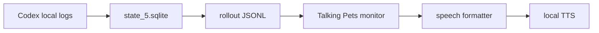

# Talking Pets

Talking Pets is a small add-on that reads Codex Pet bubbles or the latest Codex assistant reply aloud with local TTS.

It reads local conversation logs and sends short spoken lines to VOICEVOX, Kokoro, or OS speech without patching Codex or modifying a signed app bundle.


## Demo Recording

<video controls width="100%" src="docs/demo/talking-pets-overlay-2026-05-28.mov">
  <a href="docs/demo/talking-pets-overlay-2026-05-28.mov">Watch the demo recording</a>
</video>

[](docs/demo/talking-pets-overlay-2026-05-28.mov)

If GitHub does not render the video player in your environment, click the still frame above or open the [demo recording](docs/demo/talking-pets-overlay-2026-05-28.mov) directly.

Japanese: [README.md](README.md)

## Status

This repository is a public-ready MVP. The macOS Swift monitor is the stable path. Windows and Linux are experimental paths through the Node monitor.

| Environment / Feature | Status | Notes |
| --- | --- | --- |
| macOS Swift monitor | Stable | Recommended path. Uses `afplay` and `say`. |
| macOS Node monitor | Experimental | Portability path for Windows / Linux validation. |
| Windows Node monitor | Experimental | PowerShell scripts are included. Real-device validation is ongoing. |
| Linux Node monitor | Experimental | Audio playback depends on `aplay`, `paplay`, `ffplay`, or `espeak`. |
| VOICEVOX | Optional | Recommended for Japanese. Start VOICEVOX Engine separately. |
| Kokoro.js | Optional | Mostly English voices. Downloads model files on first use. |
| OS speech | Fallback | Uses macOS `say`, Windows `System.Speech`, or Linux `espeak`. |

## Important Notes

- The Pet character shown in the demo recording is from the author's local environment. This repository does not include Pet images, Live2D assets, avatar assets, or character artwork.
- Talking Pets is an MVP that reads local `state_5.sqlite` and rollout JSONL files. It does not use a public Codex API. Future Codex updates may change storage paths, database schema, JSONL shape, or Pet overlay behavior, which can break this add-on.
- If you suspect a Codex compatibility change, first run `./check.command` and `./scripts/pet-rollout-monitor.command --once --dry-run` to confirm whether the latest assistant reply can still be found.

## Requirements

Required:

- Codex Desktop or Codex CLI saving local conversation logs
- Node.js 22 or later
- npm

Stable macOS path:

- macOS
- Swift runtime
- `afplay` for audio playback
- macOS `say` as a fallback

For Japanese voices:

- VOICEVOX Engine
- VOICEVOX Engine running at `http://127.0.0.1:50021`
- Default voice: Zundamon Normal, `speaker=3`

For English voices:

- `kokoro-js`
- Network access for the first Kokoro model download

Windows experimental:

- Node.js 22 or later
- PowerShell
- VOICEVOX Engine or Kokoro
- Codex `state_5.sqlite` available under the user home directory

## Quick Start

Fast macOS path:

```bash
cd /path/to/talking-pets
./install.command
./check.command
./start-selected-tts.command
```

The installer lets you choose a local TTS provider. If unsure, choose `1` for automatic routing.

| Choice | Best for | Extra setup |
| --- | --- | --- |
| Auto routing | Mixed Japanese and English | VOICEVOX Engine and npm install |
| VOICEVOX | Natural Japanese voices | VOICEVOX Engine |
| Kokoro.js | Local English-oriented voices | npm install and first model download |
| macOS say | Fastest no-extra-install check | None |

If you choose VOICEVOX, start VOICEVOX Engine first and make sure it is listening at `http://127.0.0.1:50021`.
Kokoro.js downloads model files on first use. The default cache path is `~/.cache/talking-pets/transformers`. The default q8 model is about 92 MB, so the first run can take a little while.

## Distribution

Talking Pets is not published as an npm package yet. It is intended to be cloned from GitHub, so `package.json` intentionally remains `private: true`.

## Verify

Check your setup:

```bash
./check.command
```

Expected successful shape:

```text
Talking Pets check
==================
config: .../.talking-pets.local.env
tts: auto
node: v22.x.x
npm: x.x.x
node_modules: found
macOS say: ok (Kyoko)
dry run:
[source] ...
[pet] ...
```

If you use VOICEVOX, `VOICEVOX: ok` means the local engine is reachable. If you see `not reachable`, check that VOICEVOX Engine is running and that the URL is correct.

## Start

Start with the saved installer config:

```bash
./start-selected-tts.command
```

Manual start:

```bash
./scripts/pet-rollout-monitor.command --tts auto --skip-existing
```

Dry-run without speaking:

```bash
./scripts/pet-rollout-monitor.command --once --dry-run
```

Use a specific thread:

```bash
./scripts/pet-rollout-monitor.command --thread-id THREAD_ID --dry-run
```

Filter by workspace:

```bash
./scripts/pet-rollout-monitor.command --cwd /path/to/workspace --dry-run
```

Use a rollout JSONL file directly:

```bash
./scripts/pet-rollout-monitor.command --rollout /path/to/rollout.jsonl --dry-run
```

Use a custom Codex home or state DB:

```bash
CODEX_HOME=/path/to/codex-home ./scripts/pet-rollout-monitor.command --once --dry-run
./scripts/pet-rollout-monitor.command --state-db /path/to/state_5.sqlite --once --dry-run
```

## Stop / Restart / Change Config

- Stop: press `Ctrl-C` in the terminal running the monitor.
- Restart: run `./start-selected-tts.command` again.
- Change config: rerun `./install.command` to recreate `.talking-pets.local.env`.
- Uninstall local config: delete `.talking-pets.local.env`. You can also delete `node_modules/` if you no longer need it.

## Windows Experimental

Windows experimental:

```powershell
.\install.ps1
.\check.ps1
.\start-selected-tts.ps1
```

If PowerShell blocks script execution, allow scripts for the current shell and run the command again:

```powershell
Set-ExecutionPolicy -Scope Process -ExecutionPolicy Bypass
```

Windows support uses the experimental Node monitor. Confirm that Codex `state_5.sqlite` exists under your user home and that VOICEVOX or Kokoro is available.

## Linux Experimental

Linux support uses the experimental Node monitor.

```bash
npm install
npm run monitor:node -- --tts auto --skip-existing
npm run monitor:node -- --once --dry-run
```

Audio playback depends on `aplay`, `paplay`, `ffplay`, or `espeak`. Kokoro.js needs network access for the first model download.

## TTS Options

VOICEVOX:

```bash
./scripts/pet-rollout-monitor.command --tts voicevox --voicebox-speaker 3 --skip-existing
./scripts/pet-rollout-monitor.command --tts voicevox --list-voices
```

Kokoro:

```bash
./scripts/pet-rollout-monitor.command --tts kokoro --kokoro-voice af_heart --skip-existing
./scripts/pet-rollout-monitor.command --tts kokoro --list-voices
```

macOS say:

```bash
./scripts/pet-rollout-monitor.command --tts say --voice Kyoko --skip-existing
```

Multilingual auto routing:

```bash
./scripts/pet-rollout-monitor.command --tts auto --skip-existing
./scripts/pet-rollout-monitor.command --tts auto --speech-language ja --skip-existing
./scripts/pet-rollout-monitor.command --tts kokoro --no-language-route --skip-existing
```

Initial voice presets live in [presets/voices.json](presets/voices.json).

Excerpt:

```json
{
  "languages": {
    "ja": { "engine": "voicevox", "speaker": "3", "label": "ずんだもん ノーマル" },
    "en": { "engine": "kokoro", "voice": "af_heart", "label": "Kokoro Heart" },
    "fallback": { "engine": "say", "voice": "Kyoko", "label": "macOS say fallback" }
  }
}
```

An example local config file is available at [.talking-pets.local.env.example](.talking-pets.local.env.example).

## Troubleshooting

- `node: not found`: install Node.js 22 or later. If you only want to try macOS say, choose `4` in the installer.
- `node_modules: not found`: run `npm install` if you use Kokoro.js.
- `VOICEVOX: not reachable`: start VOICEVOX Engine and confirm the URL is `http://127.0.0.1:50021`.
- `[wait] Codex thread not found`: confirm Codex Desktop or Codex CLI is saving local conversation logs.
- `[wait] rollout unreadable`: confirm the rollout JSONL path exists and whether `CODEX_HOME` points somewhere custom.
- No sound: check OS volume, selected TTS, VOICEVOX/Kokoro state, and macOS output device.
- First Kokoro run is slow: model download is running. The default q8 model is about 92 MB, and the cache path is `~/.cache/talking-pets/transformers`.

## Language And Device Limits

- Language support prioritizes Japanese and English. Japanese routes to VOICEVOX, English routes to Kokoro.js, and other languages fall back to OS speech.
- Language detection is a short character-based heuristic. Mixed Japanese-English text, Korean, Chinese, or symbol-only short text may route to a different TTS than expected.
- Use `--speech-language ja|en|ko|other` to force the spoken language.
- OS speech quality varies by platform. Talking Pets uses macOS `say`, Windows `System.Speech`, or Linux `espeak`.
- Windows and Linux use the experimental Node monitor path. PowerShell execution and real Linux audio playback were not verified in this macOS environment.

Experimental Node monitor:

```bash
./scripts/pet-rollout-monitor-node.command --tts auto --skip-existing
npm run monitor:node -- --once --dry-run
```

Rollback on macOS is simple: use the Swift monitor again.

```bash
./scripts/pet-rollout-monitor.command --tts auto --skip-existing
```

## Speech Style Customization

The default speech formatter is local and rule-based. It does not call an LLM.
It does not hard-code a character voice. You can customize spoken phrasing with [presets/speech-style.json](presets/speech-style.json).

```json
{
  "languages": {
    "en": {
      "fallback": "New message.",
      "templates": ["{text}"],
      "stripPrefixes": ["ok", "okay", "got it"],
      "stripTerms": []
    }
  }
}
```

- `templates`: spoken line templates. `{text}` is replaced with the extracted message.
- `stripPrefixes`: short leading acknowledgements to remove.
- `stripTerms`: names or terms to remove from the spoken line.

Use a custom file:

```bash
./scripts/pet-rollout-monitor-node.command --speech-style ./my-speech-style.json --tts auto --skip-existing
```

Currently `--speech-style` is read by the Node monitor. The stable macOS Swift monitor embeds the same neutral default style.

## LLM Summaries

This MVP does not call Codex, ChatGPT, or the OpenAI API to summarize text.
It reads assistant messages already saved in local Codex logs and applies local rule-based formatting.

So the default speech formatting does not require extra OpenAI API usage.

Future LLM summarization should be optional and provider-agnostic.

- Codex / ChatGPT: availability and limits depend on your ChatGPT plan. OpenAI Help Center says Codex is included with Plus, Pro, Business, Enterprise, and Edu, and for a limited time also Free and Go. Check [Using Codex with your ChatGPT plan](https://help.openai.com/en/articles/11369540-using-codex-with-your-chatgpt-plan) for current details.
- OpenAI API: billed separately from ChatGPT plans.
- Other LLMs: local LLMs or third-party LLMs can be connected through the same future summarizer interface.

## How It Works

Talking Pets reads local Codex conversation logs.



1. Read `threads.rollout_path` from `~/.codex/state_5.sqlite`
2. Find the latest rollout JSONL for the selected thread
3. Read the latest assistant message
4. Convert it into a short spoken line
5. Send it to local TTS

It does not patch Codex itself or modify a signed application bundle.

If Codex stores data somewhere else, set `CODEX_HOME` or pass `--state-db`. If you use multiple workspaces or threads, filter by workspace with `--cwd`, or select the target directly with `--thread-id` / `--rollout`. If Codex has no local conversation log or rollout JSONL for the target, the monitor cannot find a speech candidate.

## Web Demo

You can try the browser-only speech UI.

- `demo/index.html`: browser-only demo for Web Speech API voice controls and separate display/spoken text.

The Web demo is a sample browser UI. The current default path is the rollout monitor, a long-running script that reads the latest assistant reply from local Codex logs. Opening the Web demo does not install anything into Codex Pet itself.

```bash
open demo/index.html
```

Basic HTML integration:

```html
<script src="/path/to/talking-pet-mvp.js"></script>
<script>
  TalkingPetMVP.init({
    bubbleSelector: "[data-pet-bubble]",
    observeBubble: true
  });
</script>
```

Separate display text from spoken text:

```js
window.dispatchEvent(new CustomEvent("codex-pet:message", {
  detail: {
    displayText: "This appears on screen",
    speechText: "This is the spoken version."
  }
}));
```

## Privacy

- Talking Pets reads local Codex metadata and rollout JSONL files.
- By default it does not call the OpenAI API or an external LLM summarizer.
- VOICEVOX sends text to the locally running VOICEVOX Engine.
- Kokoro.js downloads model files on first use.
- If you configure a custom TTS endpoint, conversation text may be sent to that endpoint.

## Roadmap

Detailed planning notes live in [FUTURE_PLAN.md](FUTURE_PLAN.md).

- Add more real-device validation for Windows and Linux.
- Add a settings UI or a lightweight example config file.
- Make TTS providers easier to add.
- If optional LLM summarization is added, keep it off by default and provider-agnostic.
- Replace `assets/demo-preview.png` with a real GIF or real-device screenshot.

## Release Process

- Update `CHANGELOG.md`.
- Run `npm run check:syntax` and `npm run test:dry-run`.
- Create a semver tag such as `v0.1.0`.
- In GitHub Releases, include supported OS notes, known limitations, VOICEVOX / Kokoro notices, and verified commands.

## Notes

- VOICEVOX itself is not bundled.
- Follow VOICEVOX and voice-library terms. See [CREDITS.md](CREDITS.md) for details.
- Kokoro downloads model files on first run.
- Windows support is still experimental.

## Credits

See [CREDITS.md](CREDITS.md) for third-party notices covering VOICEVOX, Kokoro, Codex, and voice/model usage.

## License

Talking Pets is released under the [MIT License](LICENSE).
