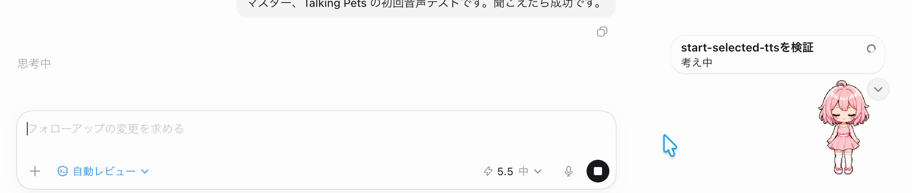
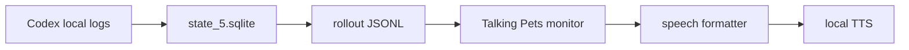

# Talking Pets

Codex Pet の吹き出しや Codex の最新 assistant 発話を、ローカルTTSで読み上げる小さなアドオンです。

Codex本体や署名済みアプリを改造せず、ローカルに保存された会話ログを読み取り、VOICEVOX / Kokoro / OS標準音声へ渡します。
既存のCodex Petを置き換えるのではなく、いま使っているPet体験へ「声」を足すための補助ツールです。

まず見る: [デモ録画](https://github.com/arata-ai-daisuki/talking-pets/blob/main/docs/demo/talking-pets-overlay-2026-05-28.mov) / [Quick Start](#quick-start) / [困ったらIssue](https://github.com/arata-ai-daisuki/talking-pets/issues)

役に立ちそうなら、GitHubでStarしてもらえると今後のTTS・多言語・レイテンシ改善の励みになります。


## デモ録画

<video controls width="100%" src="https://github.com/arata-ai-daisuki/talking-pets/raw/main/docs/demo/talking-pets-overlay-2026-05-28.mov">
  <a href="https://github.com/arata-ai-daisuki/talking-pets/blob/main/docs/demo/talking-pets-overlay-2026-05-28.mov">デモ録画を見る</a>
</video>

[](https://github.com/arata-ai-daisuki/talking-pets/blob/main/docs/demo/talking-pets-overlay-2026-05-28.mov)

GitHubの表示環境によって動画タグが再生されない場合は、上の静止画または [デモ録画](https://github.com/arata-ai-daisuki/talking-pets/blob/main/docs/demo/talking-pets-overlay-2026-05-28.mov) をクリックしてください。

English: [README.en.md](README.en.md)

## 現在の状態

このリポジトリは公開レビュー可能なMVPです。macOSのSwift monitorを安定版とし、Windows / Linux はNode monitorによる experimental 対応です。

| 環境 / 機能 | 状態 | 備考 |
| --- | --- | --- |
| macOS Swift monitor | Stable | 推奨ルート。`afplay` と `say` を利用します。 |
| macOS Node monitor | Experimental | Windows / Linux 移植用の確認ルートです。 |
| Windows Node monitor | Experimental | PowerShellスクリプトを用意しています。実機確認は継続中です。 |
| Linux Node monitor | Experimental | 音声再生は `aplay` / `paplay` / `ffplay` / `espeak` に依存します。 |
| VOICEVOX | Optional | 日本語向け。別途VOICEVOX Engineを起動してください。 |
| Kokoro.js | Optional | 英語系ボイス中心。初回にモデルを取得します。 |
| Irodori-TTS Server | Experimental optional | 日本語向け。別途 Irodori-TTS-Server を起動してください。 |
| OS標準音声 | Fallback | macOS `say`、Windows `System.Speech`、Linux `espeak` を使います。 |

## 重要な注釈

- デモ録画に写っているPetキャラクターの見た目は作者のローカル環境のものです。このリポジトリにはPet画像、Live2D素材、アバター素材は含まれていません。
- Talking Pets は Codex の公開APIではなく、ローカルに保存された `state_5.sqlite` と rollout JSONL を読むMVPです。今後のCodexアップデートで保存場所、DB schema、JSONL形式、Pet overlayの挙動が変わると動かなくなる可能性があります。
- 仕様変更が疑われる場合は、まず `npm run check:compat` でローカルCodex保存形式を確認し、必要に応じて `./scripts/pet-rollout-monitor.command --once --dry-run` で最新assistant発話を取得できているか確認してください。公開issueへ貼る前に private path、会話文、credentials を除いてください。

## Safety Model

| 対象 | 扱い |
| --- | --- |
| Codex Desktop本体 | 改造しません。署名済みアプリbundleへpatchしません。 |
| Codex local metadata | `state_5.sqlite` から thread と rollout path を読みます。 |
| Codex rollout JSONL | 最新assistant発話を読むためにローカルファイルを読みます。 |
| OpenAI API / 外部LLM | 既定では呼びません。追加API課金なしで動きます。 |
| VOICEVOX | 選択時だけ、ローカルで起動したEngineへ読み上げ文を送ります。 |
| Kokoro.js | 初回にモデルファイルを取得し、ローカルで音声を生成します。 |
| Custom TTS endpoint | 指定したendpointへ会話文が送られる可能性があります。 |

## 前提条件

必須:

- Codex Desktop / Codex CLI がローカル会話ログを保存していること
- Node.js 22 以上
- npm

macOS安定版:

- macOS
- Swift 実行環境
- 音声再生用の `afplay`
- フォールバック用の macOS `say`

日本語音声を使う場合:

- VOICEVOX Engine
- VOICEVOX Engine が `http://127.0.0.1:50021` で起動していること
- デフォルト音声: ずんだもん ノーマル `speaker=3`

英語音声を使う場合:

- `kokoro-js`
- 初回実行時にKokoroモデルを取得できるネットワーク環境

Irodori-TTSを使う場合:

- Irodori-TTS-Server
- Irodori-TTS-Server が `http://127.0.0.1:8088` で起動していること
- 日本語入力向けの実験的な手動選択providerです。既定の自動ルーティングには含めていません。

Windows experimental:

- Node.js 22 以上
- PowerShell
- VOICEVOX Engine または Kokoro
- Codex の `state_5.sqlite` がユーザーホーム配下に存在すること

Linux experimental:

- Node.js 22 以上
- bash
- 音声再生用の `aplay` / `paplay` / `ffplay`、または OS音声用の `espeak`
- VOICEVOX Engine または Kokoro を使う場合は、対応するローカルTTS環境

## Quick Start

macOSで最短確認する場合:

```bash
cd /path/to/talking-pets
./install.command
./check.command
./start-selected-tts.command
```

追加インストールなしの macOS say で固定する場合は、対話入力を次のように再現できます。

```bash
printf 'ja\n4\nKyoko\n' | ./install.command
```

macOSインストーラーでは、最初に表示言語（`en` / `ja`）を選び、その後に使うローカルTTSを選べます。迷ったら `1` の自動ルーティングを選んでください。

| 選択肢 | 向いている人 | 追加準備 |
| --- | --- | --- |
| 自動ルーティング | 日本語と英語を混ぜて使う | VOICEVOX Engine と npm ci |
| VOICEVOX | 日本語の自然な声を優先したい | VOICEVOX Engine |
| Kokoro.js | 英語系ローカル音声を使いたい | npm ci と初回モデル取得 |
| macOS say | まず追加インストールなしで試したい | なし |
| Voicebox互換endpoint | 独自または汎用ローカル音声endpointを使いたい | endpoint URL と必要なprofile/language |
| Irodori-TTS Server | Irodoriを手動起動済みで試したい | Irodori-TTS-Server |

VOICEVOX を選ぶ場合は、先に VOICEVOX Engine を起動し、`http://127.0.0.1:50021` で待ち受けている状態にしてください。
Voicebox互換endpointを選ぶ場合は、installerでendpoint URL、mode、profile、languageを保存できます。
Kokoro.js は初回読み上げ時にモデルを取得します。既定の cache path は `~/.cache/talking-pets/transformers` です。既定の q8 モデルは約92MB級なので、初回だけ時間がかかります。
Irodori-TTS Server はこのリポジトリに同梱していません。先に別ターミナルで Irodori-TTS-Server を起動し、`/health` が返る状態にしてください。
`/health` はモデルを読み込まずに返る場合があります。初回の実音声合成ではIrodoriモデルの取得やruntime loadが走るため、数分かかることがあります。モデル読み込み後の短文合成でも、CPU/GPUや端末状態によっては数十秒かかる可能性があります。
初回requestでtimeoutする場合は、Irodori-TTS-Server側で `IRODORI_PRELOAD=true` にして起動時にモデルを読み込むか、必要に応じて `IRODORI_MODEL_LOAD_TIMEOUT` / `IRODORI_SYNTHESIS_WAIT_TIMEOUT` を伸ばしてください。Talking Pets側では、`npm run tts:irodori -- --health --url http://127.0.0.1:8088 --profile-latency` で疎通を確認し、`/health` の `runtime.loaded` / `runtime.loading` を見てから短文合成を試すと切り分けやすいです。
Irodoriの体感速度は、端末性能、CPU/GPU/MPS/CUDA/ROCm、Irodori設定、テキスト長、cold/warm状態で大きく変わります。違う端末で試せる方は [Irodori latency contribution](docs/real-device-verification.md#irodori-latency-contribution) の形式で測定結果を共有してもらえると助かります。

## Distribution

現時点では npm package としては公開していません。GitHubからcloneして使う前提のため、`package.json` は `private: true` のままにしています。
`npm run check:pack` は npm publish の準備ではなく、配布対象の範囲確認です。private rollout、local config、生成音声、録画、archive、model file、`.github/` などが accidental tarball に混ざらないことを検査します。
このcheckは一時npm cacheで `npm pack --dry-run --json` を実行するため、ローカルの `~/.npm` cache 権限問題に巻き込まれにくいです。

## Verify

状態確認:

```bash
./check.command
```

Codex保存形式との互換性を確認:

```bash
npm run check:compat
```

Node.js の必要機能を確認:

```bash
npm run check:runtime
```

音声再生に使うローカルコマンドを確認:

```bash
npm run check:audio
```

プリセット、設定例、存在する場合はローカル設定を確認:

```bash
npm run check:config
```

成功時の目安:

```text
Talking Pets check
==================
platform: macOS 26.5 / arm64
config: not found
config source: none
tts: unset
speech language: auto
node: ok (v22.x.x)
npm: ok (x.x.x)
node runtime: ok
node_modules: found
VOICEVOX: ok (http://127.0.0.1:50021)
macOS say: ok (Kyoko)
compat:
[ok] fixture rollout readable: test/fixtures/assistant-rollout.jsonl (event_msg:agent_message)
[ok] fixture rollout readable: test/fixtures/mixed-ja-en-rollout.jsonl (event_msg:agent_message)
[ok] fixture rollout readable: test/fixtures/ko-zh-rollout.jsonl (event_msg:agent_message)
[ok] state DB check skipped (--no-state)
compat: ok
audio path:
[ok] macOS afplay: needed for generated WAV playback
[ok] macOS say: needed for OS speech fallback
config files:
config files: ok
dry run:
[thread] manual rollout / manual-rollout
[rollout] test/fixtures/assistant-rollout.jsonl
[source] CI dry run ready.
[pet] CI dry run ready.

This check skips local Codex state paths. Run npm run check:compat separately for stateful local Codex verification, then sanitize before sharing.
For manual local dry-run debugging, pass --cwd, --thread-id, --rollout, or --state-db to the monitor directly.
Before sharing this output publicly, remove private paths, conversation text, local env values, credentials, credential env/header values, local SQLite DBs such as state_5.sqlite, private rollout JSONL, generated audio, local recordings, archives, macOS metadata, and downloaded model files. Known public fixture rollout paths may remain visible as evidence.
```

VOICEVOXを使う場合は `VOICEVOX: ok` が出れば疎通できています。VOICEVOX Engineを起動していない場合や別TTSだけ使う場合は `not reachable` でも続けられます。
通常の `./check.command` は公開証跡へ貼りやすいようにfixtureを読み、ローカルCodex state pathは読みません。実ローカルCodex互換性は別途 `npm run check:compat` で確認してください。
`.talking-pets.local.env` が壊れている場合、`./check.command` は残りの診断を表示したあと `check: failed -> fix .talking-pets.local.env ...` で非0終了します。先に `./install.command` を再実行するか、`npm run check:config` のエラーを直してください。
公開issueへ貼る前に、ログを自動で伏せたい場合は次のように通してください。`[source]` / `[pet]` の本文、絶対パス、local env値、外部endpoint URL、よくある credential env/header、private rollout JSONL、生成音声、録画、archive、macOS metadata、ローカルSQLite DB名、モデルファイル名を伏せます。公開fixtureの `test/fixtures/assistant-rollout.jsonl`、`test/fixtures/mixed-ja-en-rollout.jsonl`、`test/fixtures/ko-zh-rollout.jsonl` は証跡用に残します。credentials は自動判定しきれない場合があるため、手動でも確認してください。

```bash
./check.command 2>&1 | npm run sanitize:public-output
```

## Start

インストーラーで保存した設定で起動:

```bash
./start-selected-tts.command
```

`start-selected-tts.command` は Node.js が使える環境では起動前に設定ファイルを検査します。macOS say だけをNodeなしで使う場合は、先に `./check.command` の表示も確認してください。

手動で起動:

```bash
./scripts/pet-rollout-monitor.command --tts auto --skip-existing
```

最新発話を読み上げずに確認:

```bash
./scripts/pet-rollout-monitor.command --once --dry-run
```

特定スレッドを指定:

```bash
./scripts/pet-rollout-monitor.command --thread-id THREAD_ID --dry-run
```

特定の作業ディレクトリで絞り込み:

```bash
./scripts/pet-rollout-monitor.command --cwd /path/to/workspace --dry-run
```

rollout JSONL を直接指定:

```bash
./scripts/pet-rollout-monitor.command --rollout /path/to/rollout.jsonl --dry-run
```

Codex home や state DB が通常と違う場合:

```bash
CODEX_HOME=/path/to/codex-home ./scripts/pet-rollout-monitor.command --once --dry-run
./scripts/pet-rollout-monitor.command --state-db /path/to/state_5.sqlite --once --dry-run
```

monitorの診断では、絶対パスは既定で `<redacted path>` として表示されます。ローカルだけで詳細を見たい場合は `--show-private-paths` を付けてください。

## Stop / Restart / Change Config

- Stop: 起動中のターミナルで `Ctrl-C` を押します。
- Restart: もう一度 `./start-selected-tts.command` を実行します。
- Change config: `./install.command` を再実行して `.talking-pets.local.env` を作り直します。
- Uninstall local config: `.talking-pets.local.env` を削除します。`node_modules/` も不要なら削除できます。

## 実機検証メモ

2026-05-28 に macOS で `macOS say` を選択して、インストールから実Pet overlay表示まで確認しました。

- install: `printf 'ja\n4\nKyoko\n' | ./install.command`
- check: `./check.command`
- start: `./start-selected-tts.command`
- demo: Codexスレッドへ短いデモ文を送信し、monitorが `source` と `pet` を検出
- recording: [docs/demo/talking-pets-overlay-2026-05-28.mov](https://github.com/arata-ai-daisuki/talking-pets/blob/main/docs/demo/talking-pets-overlay-2026-05-28.mov)
- still frame: [docs/demo/talking-pets-overlay-2026-05-28-frame.png](docs/demo/talking-pets-overlay-2026-05-28-frame.png)

録画は手動確認時の約25秒の画面収録です。Pet overlay と通知が見える構図で、AAC音声トラックを含み、音声レベルが入っていることを確認しています。

## Windows Experimental

```powershell
.\install.ps1
.\check.ps1
.\start-selected-tts.ps1
```

日本語表示で進めたい場合は `.\install.ps1 -Language ja` を使います。
読み上げ言語を固定したい場合は `.\install.ps1 -SpeechLanguage ja` のように `auto|ja|en|ko|zh|other` を指定できます。
Voicebox互換endpointを使う場合は `.\install.ps1 -Tts voicebox -VoiceboxMode generic -VoicevoxUrl http://127.0.0.1:8080 -VoiceboxProfile default -VoiceboxLanguage en` のように保存できます。

PowerShellでスクリプト実行が止まる場合は、現在のシェルだけ実行許可を緩めてから再実行します。

```powershell
Set-ExecutionPolicy -Scope Process -ExecutionPolicy Bypass
```

Windows版はNode monitorを使う experimental ルートです。実ローカルCodex互換性を確認する場合は、Codex の `state_5.sqlite` がユーザーホーム配下にあることも確認してください。音声は Windows OS speech、VOICEVOX、Kokoro.js、Voicebox-compatible endpoint、または Other local TTS を使えます。
`check.ps1` は保存済みの `.talking-pets.local.env` を読み、runtime / compat / audio / config / dry-run を順に診断します。途中の診断が失敗しても、残りの項目を表示します。
`check.ps1` の compat は公開証跡向けのfixture-only確認です。stateful Codex verification は `npm run check:compat` で別途確認し、公開前に sanitizer を通してください。
`start-selected-tts.ps1` は起動前に Node.js 22 以上と設定ファイルを確認し、不足している場合は短いエラーで停止します。

## Linux Experimental

Linux版はNode monitorを前提にした experimental ルートです。

```bash
npm ci
./install.sh
./check.sh
./start-selected-tts.sh
```

追加質問を避けたい場合は `cp presets/examples/privacy-first-say.env .talking-pets.local.env` で最小設定を作れます。
設定ファイルを使わずにfixtureで直接確認する場合は `npm run monitor:node -- --once --dry-run --rollout test/fixtures/assistant-rollout.jsonl` を使えます。
`check.sh` の compat は公開証跡向けのfixture-only確認です。stateful Codex verification は `npm run check:compat` で別途確認し、公開前に sanitizer を通してください。
音声再生は `aplay` / `paplay` / `ffplay` / `espeak` のいずれかに依存します。Kokoro.jsは初回モデル取得にネットワークが必要です。

## TTS選択

VOICEVOX:

```bash
npm run monitor:node -- --tts voicevox --voicebox-speaker 3 --skip-existing
npm run monitor:node -- --tts voicevox --list-voices
```

Kokoro:

```bash
npm run monitor:node -- --tts kokoro --kokoro-voice af_heart --skip-existing
npm run monitor:node -- --tts kokoro --list-voices
```

Irodori-TTS Server:

```bash
npm run monitor:node -- --tts irodori --no-language-route --irodori-url http://127.0.0.1:8088 --irodori-voice none --skip-existing
npm run tts:irodori -- --health --url http://127.0.0.1:8088
```

OS標準音声:

```bash
npm run monitor:node -- --tts say --voice Kyoko --skip-existing
```

多言語自動ルーティング:

```bash
npm run monitor:node -- --tts auto --skip-existing
npm run monitor:node -- --tts auto --speech-language ja --skip-existing
npm run monitor:node -- --tts kokoro --no-language-route --skip-existing
```

macOS安定版のSwift monitorで同じ確認をする場合は、`npm run monitor:node --` の代わりに `./scripts/pet-rollout-monitor.command` を使えます。

声プリセットの初期案は [presets/voices.json](presets/voices.json) にあります。

抜粋:

```json
{
  "languages": {
    "ja": { "engine": "voicevox", "speaker": "3", "label": "ずんだもん ノーマル" },
    "en": { "engine": "kokoro", "voice": "af_heart", "label": "Kokoro Heart" },
    "ko": { "engine": "say", "voice": "Kyoko", "label": "OS speech fallback for Korean" },
    "zh": { "engine": "say", "voice": "Kyoko", "label": "OS speech fallback for Chinese" },
    "fallback": { "engine": "say", "voice": "Kyoko", "label": "macOS say fallback" }
  }
}
```

ローカル設定ファイルの例は [.talking-pets.local.env.example](.talking-pets.local.env.example) にあります。
`TALKING_PETS_TTS="voicebox"` を使う場合は、必要に応じて `TALKING_PETS_VOICEBOX_MODE="voicevox"` または `"generic"`、`TALKING_PETS_VOICEBOX_PROFILE`、`TALKING_PETS_VOICEBOX_LANGUAGE` を追加できます。
保存済み設定から言語を固定したい場合は、`TALKING_PETS_SPEECH_LANGUAGE="ja|en|ko|zh|other"` を設定できます。
`TALKING_PETS_SAY_VOICE` はmacOS `say` のvoice名です。Windows `System.Speech` と Linux `espeak` では、現在この値はvoice選択に使われません。

## Troubleshooting

- `node: not found`: Node.js 22 以上をインストールしてください。macOS sayだけで試す場合はインストーラーで `4` を選びます。
- `node_modules: not found`: Kokoro.jsを使う場合は `npm ci` を実行してください。
- `VOICEVOX: not reachable`: VOICEVOX Engineを起動し、URLが `http://127.0.0.1:50021` か確認してください。
- `Irodori-TTS Server: not reachable`: Irodori-TTS-Serverを起動し、URLが `http://127.0.0.1:8088` か確認してください。
- Irodoriの `/health` は成功するが合成が遅い: 初回はモデル取得とruntime loadが入ります。まず短文1つで試し、cold start後の再試行と分けて見てください。
- Irodori合成がtimeoutする: server側でモデルロードが続いている可能性があります。server logと `/health` の `runtime.loaded` / `runtime.loading` を確認してください。
- Irodori初回requestがserver timeoutに当たる: Irodori-TTS-Server側の `IRODORI_PRELOAD=true`、`IRODORI_MODEL_LOAD_TIMEOUT`、`IRODORI_SYNTHESIS_WAIT_TIMEOUT` を確認してください。設定名はIrodori-TTS-Server側のものなので、このrepoの `.talking-pets.local.env` ではなくIrodori serverの起動環境に設定します。
- `[wait] Codex thread not found`: Codex Desktop / Codex CLI がローカル会話ログを保存しているか確認してください。
- `[wait] rollout unreadable`: rollout JSONL のパスが存在するか、`CODEX_HOME` が通常と違わないか確認してください。
- `--interval` / `--rate` / `--max-source-chars` のエラー: 数値には正の値を指定してください。`--max-source-chars` は正の整数だけ受け付けます。
- `--tts` / `--speech-language` のエラー: `--tts auto|voicevox|voicebox|kokoro|irodori|say`、`--speech-language auto|ja|en|ko|zh|other` のいずれかを指定してください。
- `npm run check:config` のURL / speaker / voiceエラー: `TALKING_PETS_VOICEVOX_URL` は `http://` または `https://` のURL、`TALKING_PETS_VOICEVOX_SPEAKER` は数値、`TALKING_PETS_VOICEBOX_MODE` は `voicevox` または `generic`、Kokoro / say / Voicebox profile / language は空でない値にしてください。
- 音が出ない: OSの音量、選択したTTS、VOICEVOX/Kokoroの状態、macOSの出力先を確認してください。
- 音声再生コマンドが見つからない: `npm run check:audio` を実行し、macOSなら `afplay` / `say`、Windowsなら PowerShell / `System.Speech`、Linuxなら `aplay` / `paplay` / `ffplay` / `espeak` の状態を確認してください。
- Kokoro初回だけ遅い: 初回モデル取得が走ります。既定の q8 モデルは約92MB級で、cache path は `~/.cache/talking-pets/transformers` です。

## Language And Device Limits

- 言語対応は日本語と英語を優先しています。日本語は VOICEVOX、英語は Kokoro.js、韓国語・中国語・その他はOS標準音声へのfallbackが基本です。
- 言語判定は短い文字種ベースです。かな文字を含む文は日本語、ハングルを含む文は韓国語、漢字だけのCJK文は中国語として扱います。日本語の漢字だけの短文や記号だけの短文では期待と違うTTSへ流れることがあります。
- `--speech-language ja|en|ko|zh|other` で言語を手動指定できます。`ko` / `zh` は現時点では専用TTS providerではなく、first-class fallback として扱います。
- OS標準音声の品質は環境差があります。macOSは `say`、Windowsは `System.Speech`、Linuxは `espeak` を使います。
- `TALKING_PETS_SAY_VOICE` / `--voice` はmacOS `say` のvoice指定です。Windows / Linux のOS音声fallbackでは未使用です。
- Windows / Linux は Node monitor の experimental ルートです。このmacOS環境ではWindows実機でのPowerShell実行とLinux実機音声再生は未確認です。

Routingだけを確認する場合は、音声を鳴らさずにJSON診断を出せます。

```bash
node --no-warnings scripts/pet-rollout-monitor.mjs --once --diagnose-routing --rollout test/fixtures/ko-rollout.jsonl
```

Node版 experimental:

```bash
./check.sh
./start-selected-tts.sh
./scripts/pet-rollout-monitor-node.command --tts auto --skip-existing
npm run monitor:node -- --once --dry-run
```

切り戻しは、macOSでは従来のSwift版を使うだけです。

```bash
./scripts/pet-rollout-monitor.command --tts auto --skip-existing
```

## 話し方のカスタマイズ

既定の読み上げ整形は、LLMを使わないローカル処理です。
固定のキャラクター口調は持たせず、[presets/speech-style.json](presets/speech-style.json) で差し替えられるようにしています。

```json
{
  "languages": {
    "ja": {
      "fallback": "新しいメッセージがあります。",
      "templates": ["{text}"],
      "stripPrefixes": [],
      "stripTerms": []
    }
  }
}
```

- `templates`: 読み上げ文のテンプレートです。`{text}` が本文に置き換わります。
- `stripPrefixes`: 先頭から落としたい短い相づちを指定します。
- `stripTerms`: 呼びかけや特定語を削りたい時に使います。

独自ファイルを使う場合:

```bash
./scripts/pet-rollout-monitor-node.command --speech-style ./my-speech-style.json --tts auto --skip-existing
```

現時点で `--speech-style` を読むのはNode版monitorです。macOS安定版のSwift monitorは、同じ既定スタイルを内蔵しています。

ローカル設定を手で置き換える場合は、`presets/examples/` に最小例があります。

- `ja-voicevox-zundamon.env`: VOICEVOX / Japanese / UI Japanese.
- `en-kokoro-heart.env`: Kokoro.js / English.
- `ko-say-fallback.env`: OS speech fallback / Korean speech-language value.
- `zh-say-fallback.env`: OS speech fallback / Chinese speech-language value.
- `privacy-first-say.env`: OS speech fallback / `auto` speech-language, no model download.
- `generic-voicebox.env`: Voicebox-compatible endpoint / generic mode / profile `default` / language `en`.

```bash
cp presets/examples/ja-voicevox-zundamon.env .talking-pets.local.env
cp presets/examples/en-kokoro-heart.env .talking-pets.local.env
cp presets/examples/ko-say-fallback.env .talking-pets.local.env
cp presets/examples/zh-say-fallback.env .talking-pets.local.env
cp presets/examples/privacy-first-say.env .talking-pets.local.env
cp presets/examples/generic-voicebox.env .talking-pets.local.env
```

## LLM要約について

現在のMVPは、CodexやChatGPT APIを追加で呼び出して要約する設計ではありません。
Codexのローカル会話ログに保存された assistant 発話を読み、ローカルのルールで短く整形します。

そのため、読み上げ整形だけなら追加のOpenAI API料金は不要です。

将来的にLLM要約を追加する場合は、任意のsummarizerとして分離する予定です。

- Codex / ChatGPT: 利用可否と上限はChatGPTプランに依存します。OpenAI Help Centerでは、CodexはPlus / Pro / Business / Enterprise / Eduに含まれ、期間限定でFree / Goにも含まれると案内されています。最新情報は [Using Codex with your ChatGPT plan](https://help.openai.com/en/articles/11369540-using-codex-with-your-chatgpt-plan) を確認してください。
- OpenAI API: ChatGPTプランとは別課金です。
- 他のLLM: ローカルLLMや他社LLMでも、同じsummarizerインターフェースに接続できる設計にする予定です。

## 仕組み

Talking Pets は、Codex がローカルへ保存している会話ログを読みます。



1. `~/.codex/state_5.sqlite` の `threads.rollout_path` を読む
2. 最新スレッドの rollout JSONL を見つける
3. 最新の assistant 発話を取得する
4. 耳で聞きやすい短いセリフへ整形する
5. ローカルTTSへ渡す

Codex本体の改造や署名済みアプリの変更はしません。

Codexの保存場所が通常と違う場合は、`CODEX_HOME` または `--state-db` を指定してください。複数workspaceや複数スレッドを使っている場合は、`--cwd` で作業ディレクトリを絞るか、`--thread-id` / `--rollout` で対象を直接指定できます。Codex側にローカル会話ログや rollout JSONL がない環境では、monitorは読み上げ候補を見つけられません。

## Webデモ

ブラウザだけで読み上げUIを試せます。

- `demo/index.html`: Web Speech API と読み上げ文/表示文の分離を試すブラウザ単体デモです。

Webデモはブラウザ上のサンプルUIです。現在の標準ルートは、Codex のローカル会話ログから最新assistant発話を読む rollout monitor です。Webデモを開くだけでは Codex Pet 本体へ組み込まれません。

```bash
open demo/index.html
```

HTMLへ直接組み込む場合:

```html
<script src="/path/to/talking-pet-mvp.js"></script>
<script>
  TalkingPetMVP.init({
    bubbleSelector: "[data-pet-bubble]",
    observeBubble: true
  });
</script>
```

表示文と読み上げ文を分ける場合:

```js
window.dispatchEvent(new CustomEvent("codex-pet:message", {
  detail: {
    displayText: "画面にはこの文章を出す",
    speechText: "これは読み上げ用の短い文です。"
  }
}));
```

## Privacy

- Talking Pets はローカルの Codex metadata と rollout JSONL を読みます。
- 既定ではOpenAI APIや外部LLMへ要約リクエストを送りません。
- VOICEVOX はローカルで起動した Engine へテキストを送ります。
- Kokoro.js は初回実行時にモデルファイルを取得します。
- `.talking-pets.local.env` は `KEY="value"` 形式として読み、既知の `TALKING_PETS_*` キーだけを受け付けます。
- 公開issueやrelease証跡に、local env、credentials、`state_5.sqlite` などのローカルSQLite DB、private rollout JSONL、生成音声、ローカル録画、archive、取得済みモデルファイルを添付しないでください。
- Irodori-TTS Server を選ぶと、ローカルで起動した Irodori endpoint へテキストを送ります。
- カスタムTTS endpointを指定する場合、そのendpointへ会話文が送られる可能性があります。

## Roadmap

詳しい検討メモは [FUTURE_PLAN.md](FUTURE_PLAN.md) に貯めます。
公開準備の継続チェックは [docs/public-repo-review-checklist.md](docs/public-repo-review-checklist.md) にあります。

- Windows / Linux の実機確認を増やす。
- 設定UIを検討する。まずは `presets/examples/` の設定例を増やす。
- TTS providerを追加しやすい形へ整理する。
- Codex保存形式の変更を検出する互換性チェックを増やす。
- 任意のLLM summarizerを追加する場合は、既定offのprovider-agnostic機能として分離する。
- 実デモGIFを追加する場合は、現在の実機スクリーンショット `assets/demo-preview.png` と差し替える。

## Release Process

- `CHANGELOG.md` を更新する。
- clean install の再現性を確認するため、`npm ci` を通す。
- `npm run check:all` を通す。
- monitor抽出やfixtureを触った場合は `npm run test:dry-run` も直接通す。
- `npm run check:config` でプリセット、設定例、ローカル設定を確認する。
- `npm run check:installers` で macOS / Windows / Linux installer が生成するローカル設定を確認する。
- ドキュメントだけを触った場合も `npm run check:docs` でMarkdownリンクとHTML内のローカル `src` / `href` を確認する。
- `.command` / `.sh` / `.ps1` / Swift script の構文は `npm run check:platform-scripts` で確認する。
- Swift monitor CLI の入力エラー表示は `npm run check:swift-cli` で確認する。
- npm tarball の配布対象は `npm run check:pack` で確認する。
- 公開前の必須ファイルと実行権限は `npm run check:release` で確認する。
- 公開ログのredaction smokeは `npm run check:sanitize` で確認する。
- 初回公開は macOS stable / Windows・Linux experimental の public preview として出してよい。Windows / Linux の実機 audible TTS 証跡は公開後に Platform verification issue で集める。
- 実機release前は `npm run check:compat`、`npm run check:audio:strict`、install、platform check、dry-run、少なくとも1つのTTS実音声再生を確認し、OS/version、CPU architecture、Node.js and npm versions、TTS path tested、speech-language value、config source、Codex Desktop / CLI version if known、Platform verification issue link と一緒に `audible: yes` / `sanitized: yes` として記録する。
- CI-only、fixture-only、`--no-state`、package check の証跡はrelease gateであり、Windows / Linux のexperimental解除には使わない。
- Node.js更新直後や別端末では `npm run check:runtime` で `node:sqlite` が使えることを確認する。
- OS別の証跡は [docs/real-device-verification.md](docs/real-device-verification.md) の形式で残す。
- 現在の検証状況は [docs/verification-status.md](docs/verification-status.md) にまとめる。
- 外部実機証跡は sanitize 済みの Platform verification issue として残し、GitHub Release の `Evidence link` 欄へ貼る。
- bug報告、install相談、TTS provider要望、platform verification の使い分けは [CONTRIBUTING.md の Issues](CONTRIBUTING.md#issues) を確認してください。
- `v0.1.0` のような semver tag を作る。
- GitHub Releases は [docs/release-notes-template.md](docs/release-notes-template.md) を元に、対応OS、既知の制限、VOICEVOX / Kokoro / Irodori の注意、確認済みコマンドを書く。

## 注意

- VOICEVOX本体は同梱していません。
- VOICEVOXや各音声ライブラリの利用規約に従ってください。詳細は [CREDITS.md](CREDITS.md) にまとめています。
- Kokoroの初回実行ではモデル取得が走ります。
- Irodori-TTS Server、Irodoriモデル、参照音声は同梱していません。
- Windows / Linux 版はまだ experimental です。

## クレジット

VOICEVOX / Kokoro / Voicebox互換endpoint / Codex など外部ソフトウェアや音声モデルに関する注意は [CREDITS.md](CREDITS.md) を確認してください。

## ライセンス

Talking Pets は [MIT License](LICENSE) で公開しています。
