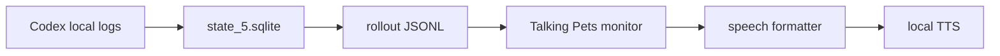

# Talking Pets

Codex Pet の吹き出しや Codex の最新 assistant 発話を、ローカルTTSで読み上げる小さなアドオンです。

Codex本体や署名済みアプリを改造せず、ローカルに保存された会話ログを読み取り、VOICEVOX / Kokoro / OS標準音声へ渡します。


English: [README.en.md](README.en.md)

## 現在の状態

このリポジトリは公開準備中のMVPです。macOSのSwift monitorを安定版とし、Windows / Linux はNode monitorによる experimental 対応です。

| 環境 / 機能 | 状態 | 備考 |
| --- | --- | --- |
| macOS Swift monitor | Stable | 推奨ルート。`afplay` と `say` を利用します。 |
| macOS Node monitor | Experimental | Windows / Linux 移植用の確認ルートです。 |
| Windows Node monitor | Experimental | PowerShellスクリプトを用意しています。実機確認は継続中です。 |
| Linux Node monitor | Experimental | 音声再生は `aplay` / `paplay` / `ffplay` / `espeak` に依存します。 |
| VOICEVOX | Optional | 日本語向け。別途VOICEVOX Engineを起動してください。 |
| Kokoro.js | Optional | 英語系ボイス中心。初回にモデルを取得します。 |
| OS標準音声 | Fallback | macOS `say`、Windows `System.Speech`、Linux `espeak` を使います。 |

## 前提条件

必須:

- Codex Desktop / Codex CLI がローカル会話ログを保存していること
- Node.js 22 以上
- npm

macOS安定版:

- macOS
- Swift 実行環境
- 音声再生用の `afplay`
- フォールバック用の macOS `say`

日本語音声を使う場合:

- VOICEVOX Engine
- VOICEVOX Engine が `http://127.0.0.1:50021` で起動していること
- デフォルト音声: ずんだもん ノーマル `speaker=3`

英語音声を使う場合:

- `kokoro-js`
- 初回実行時にKokoroモデルを取得できるネットワーク環境

Windows experimental:

- Node.js 22 以上
- PowerShell
- VOICEVOX Engine または Kokoro
- Codex の `state_5.sqlite` がユーザーホーム配下に存在すること

## Quick Start

macOSで最短確認する場合:

```bash
cd /path/to/talking-pets
./install.command
./check.command
./start-selected-tts.command
```

インストーラーでは、使うローカルTTSを選べます。迷ったら `1` の自動ルーティングを選んでください。

| 選択肢 | 向いている人 | 追加準備 |
| --- | --- | --- |
| 自動ルーティング | 日本語と英語を混ぜて使う | VOICEVOX Engine と npm install |
| VOICEVOX | 日本語の自然な声を優先したい | VOICEVOX Engine |
| Kokoro.js | 英語系ローカル音声を使いたい | npm install と初回モデル取得 |
| macOS say | まず追加インストールなしで試したい | なし |

VOICEVOX を選ぶ場合は、先に VOICEVOX Engine を起動し、`http://127.0.0.1:50021` で待ち受けている状態にしてください。
Kokoro.js は初回読み上げ時にモデルを取得します。既定の cache path は `~/.cache/talking-pets/transformers` です。既定の q8 モデルは約92MB級なので、初回だけ時間がかかります。

## Distribution

現時点では npm package としては公開していません。GitHubからcloneして使う前提のため、`package.json` は `private: true` のままにしています。

## Verify

状態確認:

```bash
./check.command
```

成功時の目安:

```text
Talking Pets check
==================
config: .../.talking-pets.local.env
tts: auto
node: v22.x.x
npm: x.x.x
node_modules: found
macOS say: ok (Kyoko)
dry run:
[source] ...
[pet] ...
```

VOICEVOXを使う場合は `VOICEVOX: ok` が出れば疎通できています。`not reachable` の場合は、VOICEVOX Engineが起動しているか、URLが合っているかを確認してください。

## Start

インストーラーで保存した設定で起動:

```bash
./start-selected-tts.command
```

手動で起動:

```bash
./scripts/pet-rollout-monitor.command --tts auto --skip-existing
```

最新発話を読み上げずに確認:

```bash
./scripts/pet-rollout-monitor.command --once --dry-run
```

特定スレッドを指定:

```bash
./scripts/pet-rollout-monitor.command --thread-id THREAD_ID --dry-run
```

特定の作業ディレクトリで絞り込み:

```bash
./scripts/pet-rollout-monitor.command --cwd /path/to/workspace --dry-run
```

rollout JSONL を直接指定:

```bash
./scripts/pet-rollout-monitor.command --rollout /path/to/rollout.jsonl --dry-run
```

Codex home や state DB が通常と違う場合:

```bash
CODEX_HOME=/path/to/codex-home ./scripts/pet-rollout-monitor.command --once --dry-run
./scripts/pet-rollout-monitor.command --state-db /path/to/state_5.sqlite --once --dry-run
```

## Stop / Restart / Change Config

- Stop: 起動中のターミナルで `Ctrl-C` を押します。
- Restart: もう一度 `./start-selected-tts.command` を実行します。
- Change config: `./install.command` を再実行して `.talking-pets.local.env` を作り直します。
- Uninstall local config: `.talking-pets.local.env` を削除します。`node_modules/` も不要なら削除できます。

## 実機検証メモ

2026-05-28 に macOS で `macOS say` を選択して、インストールから実Pet overlay表示まで確認しました。

- install: `printf '4\nKyoko\n' | ./install.command`
- check: `./check.command`
- start: `./start-selected-tts.command`
- demo: Codexスレッドへ短いデモ文を送信し、monitorが `source` と `pet` を検出
- recording: [docs/demo/talking-pets-overlay-2026-05-28.mov](docs/demo/talking-pets-overlay-2026-05-28.mov)
- still frame: [docs/demo/talking-pets-overlay-2026-05-28-frame.png](docs/demo/talking-pets-overlay-2026-05-28-frame.png)

録画は手動確認時の約25秒の画面収録です。Pet overlay と通知が見える構図で、AAC音声トラックを含み、音声レベルが入っていることを確認しています。

## Windows Experimental

```powershell
.\install.ps1
.\check.ps1
.\start-selected-tts.ps1
```

PowerShellでスクリプト実行が止まる場合は、現在のシェルだけ実行許可を緩めてから再実行します。

```powershell
Set-ExecutionPolicy -Scope Process -ExecutionPolicy Bypass
```

Windows版はNode monitorを使う experimental ルートです。Codex の `state_5.sqlite` がユーザーホーム配下にあること、VOICEVOX または Kokoro が利用できることを確認してください。

## Linux Experimental

Linux版はNode monitorを前提にした experimental ルートです。

```bash
npm install
npm run monitor:node -- --tts auto --skip-existing
npm run monitor:node -- --once --dry-run
```

音声再生は `aplay` / `paplay` / `ffplay` / `espeak` のいずれかに依存します。Kokoro.jsは初回モデル取得にネットワークが必要です。

## TTS選択

VOICEVOX:

```bash
./scripts/pet-rollout-monitor.command --tts voicevox --voicebox-speaker 3 --skip-existing
./scripts/pet-rollout-monitor.command --tts voicevox --list-voices
```

Kokoro:

```bash
./scripts/pet-rollout-monitor.command --tts kokoro --kokoro-voice af_heart --skip-existing
./scripts/pet-rollout-monitor.command --tts kokoro --list-voices
```

macOS say:

```bash
./scripts/pet-rollout-monitor.command --tts say --voice Kyoko --skip-existing
```

多言語自動ルーティング:

```bash
./scripts/pet-rollout-monitor.command --tts auto --skip-existing
./scripts/pet-rollout-monitor.command --tts auto --speech-language ja --skip-existing
./scripts/pet-rollout-monitor.command --tts kokoro --no-language-route --skip-existing
```

声プリセットの初期案は [presets/voices.json](presets/voices.json) にあります。

抜粋:

```json
{
  "languages": {
    "ja": { "engine": "voicevox", "speaker": "3", "label": "ずんだもん ノーマル" },
    "en": { "engine": "kokoro", "voice": "af_heart", "label": "Kokoro Heart" },
    "fallback": { "engine": "say", "voice": "Kyoko", "label": "macOS say fallback" }
  }
}
```

ローカル設定ファイルの例は [.talking-pets.local.env.example](.talking-pets.local.env.example) にあります。

## Troubleshooting

- `node: not found`: Node.js 22 以上をインストールしてください。macOS sayだけで試す場合はインストーラーで `4` を選びます。
- `node_modules: not found`: Kokoro.jsを使う場合は `npm install` を実行してください。
- `VOICEVOX: not reachable`: VOICEVOX Engineを起動し、URLが `http://127.0.0.1:50021` か確認してください。
- `[wait] Codex thread not found`: Codex Desktop / Codex CLI がローカル会話ログを保存しているか確認してください。
- `[wait] rollout unreadable`: rollout JSONL のパスが存在するか、`CODEX_HOME` が通常と違わないか確認してください。
- 音が出ない: OSの音量、選択したTTS、VOICEVOX/Kokoroの状態、macOSの出力先を確認してください。
- Kokoro初回だけ遅い: 初回モデル取得が走ります。既定の q8 モデルは約92MB級で、cache path は `~/.cache/talking-pets/transformers` です。

## Language And Device Limits

- 言語対応は日本語と英語を優先しています。日本語は VOICEVOX、英語は Kokoro.js、その他はOS標準音声へのfallbackが基本です。
- 言語判定は短い文字種ベースです。日本語と英語が混ざる文、韓国語、中国語、記号だけの短文では期待と違うTTSへ流れることがあります。
- `--speech-language ja|en|ko|other` で言語を手動指定できます。
- OS標準音声の品質は環境差があります。macOSは `say`、Windowsは `System.Speech`、Linuxは `espeak` を使います。
- Windows / Linux は Node monitor の experimental ルートです。このmacOS環境ではPowerShell実行とLinux実機音声再生は未確認です。

Node版 experimental:

```bash
./scripts/pet-rollout-monitor-node.command --tts auto --skip-existing
npm run monitor:node -- --once --dry-run
```

切り戻しは、macOSでは従来のSwift版を使うだけです。

```bash
./scripts/pet-rollout-monitor.command --tts auto --skip-existing
```

## 話し方のカスタマイズ

既定の読み上げ整形は、LLMを使わないローカル処理です。
固定のキャラクター口調は持たせず、[presets/speech-style.json](presets/speech-style.json) で差し替えられるようにしています。

```json
{
  "languages": {
    "ja": {
      "fallback": "新しいメッセージがあります。",
      "templates": ["{text}"],
      "stripPrefixes": [],
      "stripTerms": []
    }
  }
}
```

- `templates`: 読み上げ文のテンプレートです。`{text}` が本文に置き換わります。
- `stripPrefixes`: 先頭から落としたい短い相づちを指定します。
- `stripTerms`: 呼びかけや特定語を削りたい時に使います。

独自ファイルを使う場合:

```bash
./scripts/pet-rollout-monitor-node.command --speech-style ./my-speech-style.json --tts auto --skip-existing
```

現時点で `--speech-style` を読むのはNode版monitorです。macOS安定版のSwift monitorは、同じ既定スタイルを内蔵しています。

## LLM要約について

現在のMVPは、CodexやChatGPT APIを追加で呼び出して要約する設計ではありません。
Codexのローカル会話ログに保存された assistant 発話を読み、ローカルのルールで短く整形します。

そのため、読み上げ整形だけなら追加のOpenAI API料金は不要です。

将来的にLLM要約を追加する場合は、任意のsummarizerとして分離する予定です。

- Codex / ChatGPT: 利用可否と上限はChatGPTプランに依存します。OpenAI Help Centerでは、CodexはPlus / Pro / Business / Enterprise / Eduに含まれ、期間限定でFree / Goにも含まれると案内されています。最新情報は [Using Codex with your ChatGPT plan](https://help.openai.com/en/articles/11369540-using-codex-with-your-chatgpt-plan) を確認してください。
- OpenAI API: ChatGPTプランとは別課金です。
- 他のLLM: ローカルLLMや他社LLMでも、同じsummarizerインターフェースに接続できる設計にする予定です。

## 仕組み

Talking Pets は、Codex がローカルへ保存している会話ログを読みます。



1. `~/.codex/state_5.sqlite` の `threads.rollout_path` を読む
2. 最新スレッドの rollout JSONL を見つける
3. 最新の assistant 発話を取得する
4. 耳で聞きやすい短いセリフへ整形する
5. ローカルTTSへ渡す

Codex本体の改造や署名済みアプリの変更はしません。

Codexの保存場所が通常と違う場合は、`CODEX_HOME` または `--state-db` を指定してください。複数workspaceや複数スレッドを使っている場合は、`--cwd` で作業ディレクトリを絞るか、`--thread-id` / `--rollout` で対象を直接指定できます。Codex側にローカル会話ログや rollout JSONL がない環境では、monitorは読み上げ候補を見つけられません。

## Webデモ

ブラウザだけで読み上げUIを試せます。

- `demo/index.html`: Web Speech API と読み上げ文/表示文の分離を試すブラウザ単体デモです。

Webデモはブラウザ上のサンプルUIです。現在の標準ルートは、Codex のローカル会話ログから最新assistant発話を読む rollout monitor です。Webデモを開くだけでは Codex Pet 本体へ組み込まれません。

```bash
open demo/index.html
```

HTMLへ直接組み込む場合:

```html
<script src="/path/to/talking-pet-mvp.js"></script>
<script>
  TalkingPetMVP.init({
    bubbleSelector: "[data-pet-bubble]",
    observeBubble: true
  });
</script>
```

表示文と読み上げ文を分ける場合:

```js
window.dispatchEvent(new CustomEvent("codex-pet:message", {
  detail: {
    displayText: "画面にはこの文章を出す",
    speechText: "これは読み上げ用の短い文です。"
  }
}));
```

## Privacy

- Talking Pets はローカルの Codex metadata と rollout JSONL を読みます。
- 既定ではOpenAI APIや外部LLMへ要約リクエストを送りません。
- VOICEVOX はローカルで起動した Engine へテキストを送ります。
- Kokoro.js は初回実行時にモデルファイルを取得します。
- カスタムTTS endpointを指定する場合、そのendpointへ会話文が送られる可能性があります。

## Roadmap

詳しい検討メモは [FUTURE_PLAN.md](FUTURE_PLAN.md) に貯めます。

- Windows / Linux の実機確認を増やす。
- 設定UIまたは軽量な設定ファイル例を整える。
- TTS providerを追加しやすい形へ整理する。
- 任意のLLM summarizerを追加する場合は、既定offのprovider-agnostic機能として分離する。
- 実デモGIFまたは実機スクリーンショットへ `assets/demo-preview.png` を差し替える。

## Release Process

- `CHANGELOG.md` を更新する。
- `npm run check:syntax` と `npm run test:dry-run` を通す。
- `v0.1.0` のような semver tag を作る。
- GitHub Releases には、対応OS、既知の制限、VOICEVOX / Kokoro の注意、確認済みコマンドを書く。

## 注意

- VOICEVOX本体は同梱していません。
- VOICEVOXや各音声ライブラリの利用規約に従ってください。詳細は [CREDITS.md](CREDITS.md) にまとめています。
- Kokoroの初回実行ではモデル取得が走ります。
- Windows版はまだ experimental です。

## クレジット

VOICEVOX / Kokoro / Codex など外部ソフトウェアや音声モデルに関する注意は [CREDITS.md](CREDITS.md) を確認してください。

## ライセンス

Talking Pets は [MIT License](LICENSE) で公開しています。
